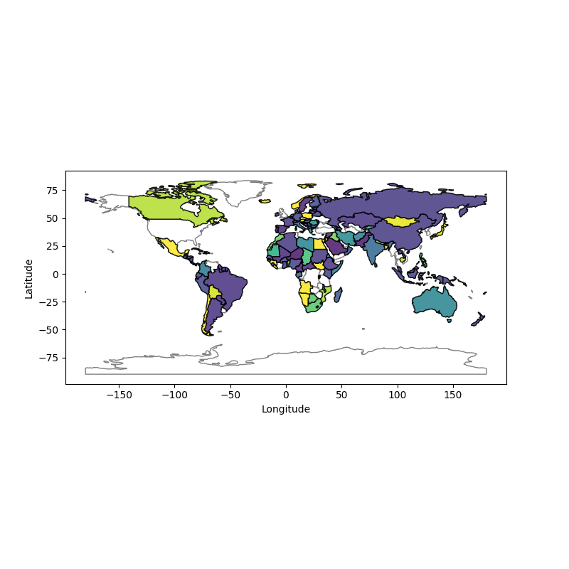
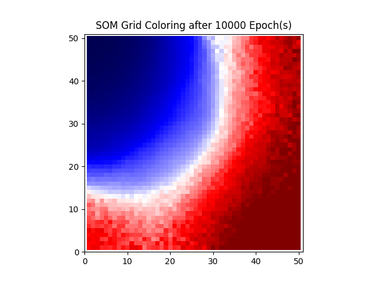
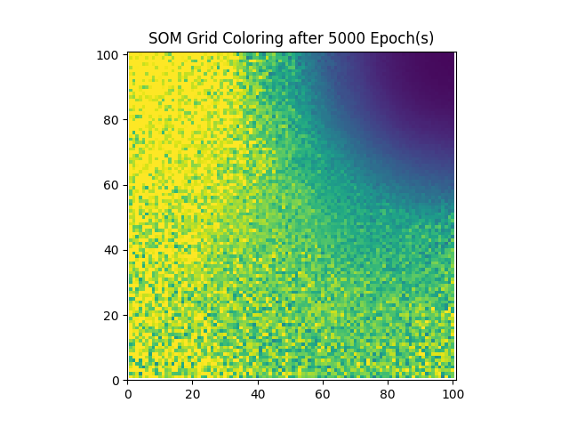

# Self-Organizing-Map

This repository contains the third assignment of the course ```CS 451 - Computational Intelligence```. The assignment is about giving a hands-on experience with ```Self Organizing Maps - SOMS``` for clustering and visualization of the [Covid19 Data](Q1_countrydata.csv).

The dataset gives country-wise data of COVID19 confirmed, recovered and expired cases by Jan 2021. ```SOM``` will be implemented on the dataset to cluster the data, where each country will be belonging to one cluster. For visualization, the three data fields (Confirmed, Recovered, Deaths) have been mapped onto RGB Values which appear as different colors on the SOM Grid, showing the eventual convergence of the SOM over many epochs. Each color represents a cluster and its varying shades denotes similar clusters. Then the countries on the world map are colored based on the SOM Grid cluster.

#### Running the Code
The [som.py](som.py) file contains the ```SOM``` class, which is basically fed with the dataset and its parameters that include:
- Number of Rows and Columns in the SOM Grid
- Learning Rate
- Radius of the Neighbourhood
- Number of Epochs
- Dataset as per the main file

It also contains methods to color the SOM Grid cluster and visualize the resulting countries on the world map.

The main file [main.py](main.py) contains the code to read the dataset, normalize the data, make a ```SOM``` object and train it. The trained SOM is then used to color the countries on the world map.

The code can be run by executing the following command:
```python main.py```

Feel free to change the parameters. The ```SOM``` class also contains commented out color schemes that you can uncomment to see different color mappings.

Some of the sample ```SOM``` grid clusters and their corresponding world mappings are shown below:

<div>
 
</div>
<div>
 
</div>
<div>
 
</div>
<div>
 
</div>